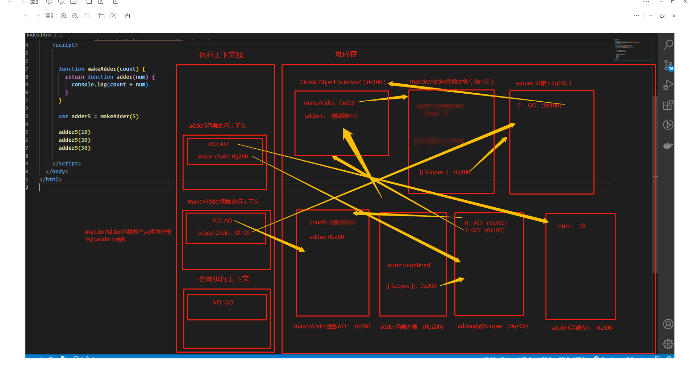

# 闭包的定义
+ 维基百科的定义
  1. 闭包、又称`词法闭包（lexical closure）`或`函数闭包（function closures）`
  2. 是在支持`头等函数`的编程语言中，实现词法绑定的一种技术
  3. 闭包在实现上是一个`结构体`，它存储了`一个函数和一个关联的环境`
  4. 闭包跟函数最大的区别在于，当捕捉闭包的时候，它的自由变量会在捕捉时被确认，这样即使脱离了捕捉时的上下文，它也能照常运行。
   
+ MDN的定义
  1. 一个函数和对其周围状态（lexical environment，词法环境）的引用捆绑在一起（或者说函数被引用包围），这样的组合就是闭包（closure）。
  2. 也就是说，闭包让你可以在一个内层函数中访问到其外层函数的作用域。
  3. 在 JavaScript 中，每当创建一个函数，闭包就会在函数创建的同时被创建出来。

+ 个人理解
  1. 一个函数如果可以访问到外层作用域的自由变量，那么这个函数和周围的环境就是一个闭包。
  2. 从广义的角度来说：JavaScript中的函数都是闭包。
  3. 从狭义的角度来说：JavaScript中一个函数，如果访问了外层作用域的变量，那么它是一个闭包。

# 没有闭包的局限性
没有实现闭包和实现闭包的区别，如：
```JavaScript
var name = '小鱼儿'
var age = 18
var height = 1.65
var sex = '女'


// 没有实现闭包的话，使用外层作用域中变量的实现方法 （需要通过传参的方式传进去）
function logInfo(name, age, height, sex) {
  console.log(name, age, height, sex)
}
logInfo1(name, age, height, sex)

// 实现闭包的话，可以直接在函数中访问外层作用域中的变量
function logInfo2() {
  console.log(name, age, height, sex)
}
logInfo2()
```
JavaScript中的闭包采用了`作用域链（scope chain）`的方式来实现闭包，可以让我们在函数中一层一层的向上查抄，从而可以使用到外层作用域中的变量，实现了闭包。


# 闭包的内存泄露
对于那些我们永远不再使用的对象，但是对于GC来说，它永远不知道要进行释放，对应的内存依旧会存在。


# 小知识
闭包的概念出现于60年到，最早实现闭包的程序是`Scheme`，那么我们就可以理解为什么JavaScript中有闭包。 因为JavaScript中有大量的设计来源于Scheme的。(JavaScript作者喜欢Scheme)


```JavaScript
function makeAdder(count) {
  return function adder(num) {
    console.log(count + num)
  }
}

var adder5 = makeAdder(5)

adder5(10)
adder5(20)
adder5(30)
```

