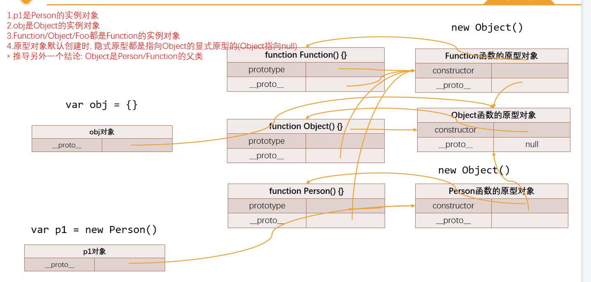

# 认识对象的原型
## 一：什么是对象的原型
JavaScript当中每个对象都有一个特殊的内置属性`[[prototype]]`，这个特殊的对象可以指向另外一个对象。这个属性就是这个对象的原型，这个属性的值指向的又是另一个对象。

## 二：这个对象的作用

当我们通过对象的属性key来获取value的时候，会触发`[[Get]]`操作，这个操作会先检查对象中是否有这个属性，如果有就是用它，如果对象中没有这个属性，那么就会去对象内置的`[[prototype]]`属性指向的对象中属性。

```JavaScript
var obj = {
  name: 'y_mixin_o',
  age: 21
}

Object.getPrototypeOf(obj).message = 'Hello Word'

// 对象中没有会去对象内置的[[prototype]]属性指向的对象上的属性
console.log(obj.message) // Hello Word
```
只要是对象那么都有这样一个属性(`[[prototype]]`)

## 三: 获取对象中`[[proptype]]`属性的两种方式: 

+ 通过对象上的`__proto__`属性可以获取到对象的`[[prototype]]`属性。（这个是浏览器自己添加的，存在兼容性问题）
+ 通过Object.getPrototypeOf方法可以获取到对象的`[[prototype]]`属性。
+ 
```JavaScript
var obj = {
  name: 'y_mixin_o',
  age: 21
}

console.log(obj.__proto__ === Object.getPrototypeOf(obj)) // true
```


# 函数的原型prototype
每个函数上都有有一个`prototype`属性，它就是函数的原型。

## 一: 显示原型和隐式原型
一般对象上的`__proto__`属性，我们可以称为`隐式原型`，它的作用是通过key获取value时，会找到它；函数的`prototype`属性可以称为`显示原型`是用来给对象设置`隐式原型`的。

## 二: prototype的作用
在使用new操作符构建对象的时候，会将显示原型赋值给创建对象的隐式原型。当我们多个对象拥有共同的值时，我们可以将它放到构造函数对象的显示原型，由构造函数创建出来的所有对象，都会共享这些属性。


# new操作符

## new操作符的操作步骤
+ 一: 在内存中创建一个对象（空对象）
+ 二: 将这个对象赋值给this，并将函数的显示原型赋值给这个对象的`[[prototype]]`属性作为它的隐式原型。
```JavaScript
function Foo() {}

var f1 = new Foo()
var f2 = new Foo()
var f3 = new Foo()

console.log(f1.__proto__ === Foo.prototype) // true
console.log(f1.__proto__ === f2.__proto__) // true
console.log(f1.__proto__ === f3.__proto__) // true
console.log(f2.__proto__ === f3.__proto__) // true
```
+ 三: 执行函数体中的代码
+ 四: 将这个对象默认返回

注: 通过构造函数创建出来的对象的`[[prototype]]`属性都指向函数的prototype属性。


# 显示原型中的属性（constructor）
显示原型中constructor属性很重要，它指向自身的函数对象。
```JavaScript
function Foo() {}

console.log(Foo.prototype.constructor === Foo) // true
console.log(Foo.name === Foo.name) // true
```

# 原型链

默认对象的原型链的查找顺序： `obj.__proto__ -> obj.__proto -> null`。

先在自身查找，如果没有在自己的原型上查找，原型上没有就会在原型的原型上查找，一直找到null，如果还没有就返回undefined
```JavaScript
var obj = {
  name: 'y_mixin_o'
}
```


# 通过原型链实现继承

实现继承的机制：JavaScript中通过原型链一层一层向上查找的机制实现继承。

# 方法一（错误）: 将父类的原型直接赋值给子类的原型
这种做法是`错误`的：在内存中的表现就是，这两个对象的原型都指向Person的原型对象，所以在每次通过new的方式创建一个student对象时，所有的student对象的原型都指向Person的原型对象，虽然这样可以查找到对应的属性或方法，但是如果每个student在给原型添加属性或者方法的时候并不是添加到自己student对象的原型上而是添加到Person的原型对象上，这样就会导致Person的原型对象越来越大。

缺点: 父类和子类共享一个原型对象，修改了任意一个，另一个也被修改
```JavaScript
function Person(name, age) {
  this.name = name;
  this.age = age;
}

Person.prototype.running = function () {};
Person.prototype.eating = function () {};

function Student(name, age, sno) {
  this.name = name;
  this.age = age;
  this.sno = sno;
}

Studen.prototype = Person.prototype; // 错误的

Student.prototype.running = function () {};
Student.prototype.eating = function () {};
Student.prototype.studying = function () {};
```

# 方法二: 创建一个父类的实例对象作为子类的原型

缺点: 
+ 我们打印stu的原型的话是看不到这些(name, age)属性的，这些属性都在Person的原型上
+ 每个studetnt对象不能拥有自己独立的属性值，这些student对象在实例化Person的时候已经被确定了
+ 这些属性被多个对象共享，如果是这些属性的值是引用类型，那么就会造成问题。

```JavaScript

function Person(name, age) {
  this.name = name;
  this.age = age;
}

Person.prototype.running = function () {
  console.log('running')
};
Person.prototype.eating = function () {
  console.log('eating')
};

function Student(name, age, sno) {
  // 如果想让每个student对象都拥有自己独立属性就得再一次编写对应的逻辑
  // 如果有多个重复的属性我们就得一个个去编写。
  // this.name = name;
  // this.age = age;
  this.sno = sno;
}

// 创建一个Person的实例对象作为student的原型
var p = new Person('y_mixin_o', 21)
Student.prototype = p


Student.prototype.studying = function () {
  console.log('studying')
};

var stu1 = new Student('学生', 18, 89)
var stu2 = new Student('学生', 18, 89)

stu1.running() // running
stu1.eating() // eating
stu1.studying() // studying

console.log(stu1) // { sno: 89 }
console.log(stu1.name, stu1.age) // y_mixin_o 21
console.log(stu2.name, stu2.age) // y_mixin_o 21
```

# 借用构造函数继承
为了解决原型链继承中存在属性问题，就出现了借用构造函数继承的解决方法。

借用构造函数继承的做法: 在子类的构造函数内部调用父类的构造函数
```JavaScript

function Person(name, age) {
  this.name = name;
  this.age = age;
}

Person.prototype.running = function () {};
Person.prototype.eating = function () {};

function Student(name, age, sno) {

  // 通过借用父类的构造函数继承
  // 通过new创建的student对象会创建一个空对象，并把this指向这个空对象
  // 这时候我们调用Person方法，通过call/apply让其this指向当前创建的对象
  // 让父类的构造函数去帮助我们赋值，在赋值时的this就是指向我们当前新创建的student实例对象
  // 这样我们就可以不用手动的一个个去编写赋值
  Person.call(this, name, age)

  this.sno = sno;
}

// 创建一个person的实例对象作为student的原型
var p = new Person('y_mixin_o', 21)
Student.prototype = p

Student.prototype.studying = function () {};

var stu = new Student('学生', 18, 89)

console.log(stu) // { name: '学生', age: 18, sno: 89 }

```

# 组合借用继承

通过`方法二 + 借用构造函数`已经实现了继承，让子类可以访问和使用到父类的属性和方法。我们也称这个为组合借用继承，通过这种方式基本上已经实现继承没有什么问题。

缺点: 
+ 无论什么情况下，都会调用两次父类的构造函数
```JavaScript
function Person(name, age) {
  this.name = name;
  this.age = age;
}

function Student(name, age, height) {
  // 第一次
  Person.call(this, name, age)
  this.height = height
}

// 第二次
var p = new Person('y_mixin_o', 21)
Student.prototype = p
```
+ 所有子类都拥有两份相同的属性，一份在子类实例对象本身，一份在子类的原型对象中，不用担心访问出现问题，因为默认一定是先访问实例本身。
```JavaScript
function Person(name, age) {
  this.name = name;
  this.age = age;
}

function Student(name, age, height) {
  // 第一次
  Person.call(this, name, age)
  this.height = height
}

// 第二次
var p = new Person('y_mixin_o', 21)
Student.prototype = p

var stu = new Student('学生', 18, 1.88)

// 拥有两份相同的属性(一份在子类实例对象本身，一份在子类的原型对象中)
console.log(stu) // { name: '学生', age: 18, height: 1.88 }
console.log(stu.__proto__) // { name: 'y_mixin_o', age: 21, height: 1.88 }
```

组合继承的缺点其实都是出现在中间的Person实例对象上，其实我们是不是只需要让子类对象的隐式原型指向父类对象的显示原型，任何一个对象都可以呢，想想这个对象需要满足什么条件:

+ 需要创建一个对象
+ 这个对象的隐式原型需要指向父类的显示原型
+ 将这个对象赋值给子类的显示原型

而原型式继承就是为了解决这个问题提出的解决方法。

# 原型式继承函数
原型式继承函数的最终目的是: 让子类对象的隐式原型指向父类对象的显示原型。
```JavaScript
 function Person(name, age) {
  this.name = name 
  this.age = age
}

function Student(name, age, height) {
  Person.call(this, name, age)
  this.height = height
}

// 方法一: 不推荐，需要考虑__proto__属性兼容性问题
var obj = {}
obj.__proto__ = Person.prototype 
Student.prototype = obj

// 方法二: 通过Object.setPrototypeOf设置obje的隐式原型
var obj = {}
Object.setPrototypeOf(obj, Person.prototype)
Student.prototype = obj

// 方法三: 通过一个中间函数
function F() {}
F.prototype = Person.prototype
Student.prototype = new F()

// 方法四: 通过Object.create() 返回一个指向指定原型的对象
var obj = Object.create(Person.prototype)
Student.prototype = obj
```

# 寄生组合继承
通过原型式的思想，我们会封装一个继承函数，来帮我们实现继承。
```JavaScript
// 原型式函数
function createObj(o) {
  function F() {}
  F.prototype = o
  return new F()
}

// 寄生组合函数
function inherit(Subtype, Supertype) {
  // var obj = Object.create(Supertype.prototype)
  var obj = createObj(Supertype.prototype)
  Subtype.prototype = obj
  Object.defineProperty(obj, 'constructor', {
    configurable: true,
    enumerable: false,
    writable: true,
    value: Subtype
  })
}

function Person(name, age) {
  this.name = name 
  this.age = age
}

function Student(name, age, height) {
  Person.call(this, name, age)
  this.height = height
}

// 调用寄生组合函数实现继承
inherit(Student, Person)
```


# 最终继承方案的写法（寄生组合式继承）
实现的技术: 原型链/原型式(对象之间)/寄生式函数

```JavaScript
function createObj(o) {
  function F() {}
  F.prototype = o
  return new F()
}

function inherit(Subtype, Supertype) {
  var obj = createObj(Supertype.prototype)
  Subtype.prototype = obj
  Object.defineProperty(obj, 'constructor', {
    configurable: true,
    enumerable: false,
    writable: true,
    value: Subtype
  })
}

function Person(name, age) {
  this.name = name 
  this.age = age
}

Person.prototype.running = function() {
  console.log('running')
}
Person.prototype.eating = function() {
  console.log('eating')
}

function Student(name, age, height) {
  Person.call(this, name, age)
  this.height = height
}

inherit(Student, Person)

Student.prototype.studying = function() {
  console.log('studying')
}

var stu = new Student('y_mixin_o', 21, 1.88)

console.log(stu) // { name: 'y_mixin_o', age: 21, height: 1.88 }
stu.running() // running
stu.eating() // eating
stu.studying() // studying
```

# 对象方法的补充

## hasOwnProperty

判断对象中的某个属性是否属于自己（不是在原型上）。

```JavaScript
function createObj(o) {
  function F() {}
  F.prototype = o;
  return new F();
}

var obj = {
  name: 'obj',
  age: 18,
};

var info = createObj(obj);

info.address = '福州'

console.log(info.hasOwnProperty('name')) // false
```

## in/for in 操作符
判断某个属性是否在某个对象或者对象的原型上
```JavaScript

console.log('name' in info) // true
console.log('address' in info) // true


for (var key in info) {
  console.log(key) // name age address
}
```

## instanceof 
用于检测构造函数的prototype，是否出现在某个实例对象的原型链上

```JavaScript
function Person() {}
function Student() {}

inherit(Student, Person) // Student extends Person

var stu = new Student()

console.log(stu instanceof Student) // true
console.log(stu instanceof Person) // true
console.log(stu instanceof Object) // true

```

## isPrototypeOf 
用于检测某个对象，是否出现在某个实例对象的原型链上

```JavaScript
function createObj(o) {
  function F() {}
  F.prototype = o;
  return new F();
}

var obj = {
  name: "obj",
  age: 18,
};

var info = createObj(obj);W
info.address = "福州";

console.log(obj.isPrototypeOf(info)) // true
```

# 原型继承关系图




得出的结论: 
+ 1.p1是Person的实例对象
+ 2.obj是Object的实例对象
+ 3.Function/Object/Foo都是Function的实例对象
+ 4.原型对象默认创建时, 隐式原型都是指向Object的显式原型的(Object指向null)
+ *推导另外一个结论: Object是Person/Function的父类


# 知识补充
+ Object类是所有类的父类
+ 添加在原型上的方法也叫做实例方法
+ 添加在类上的方法叫做类方法